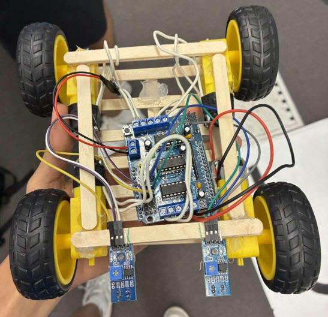

# Autonomous Line-Following Robot

## Overview
This project is an Arduino-based robot designed to autonomously follow a marked path using infrared sensors. The robot detects the contrast between the line and the surrounding surface and adjusts the speed and direction of its wheels to stay aligned with the path. This project was developed during the University of Toronto CREATE Engineering Summer Program as part of a team-based robotics build.

---

## Robot Photo

---

## Demo Video

Click the image below to watch the robot following a marked path.

---

## Features
- Autonomous line-following using infrared sensors
- Real-time sensor feedback for navigation adjustments
- Continuous wheel control for path tracking
- Team-based design and prototyping

---

## Hardware Components
- Arduino Uno  
- Infrared line-following sensors  
- Continuous rotation servos / DC motors  
- Robot chassis  
- Breadboard and jumper wires  
- Battery pack  

---

## How It Works
Infrared sensors positioned underneath the robot detect the difference between the dark line and the lighter surface. When the sensors detect that the robot is drifting away from the line, the Arduino adjusts the rotation speed of the wheels to steer the robot back toward the path. This continuous feedback loop allows the robot to remain aligned with the line while moving forward.

---

## Development Context
This robot was designed and built during the University of Toronto CREATE Engineering Summer Program. The project involved collaborative prototyping, assembling the robot chassis, integrating sensors, and testing the robot's ability to follow different line paths.

---

## Future Improvements
- Improve turning precision at sharp corners
- Add additional sensors for better path detection
- Optimize the control algorithm for smoother movement
- Implement adjustable speed control
